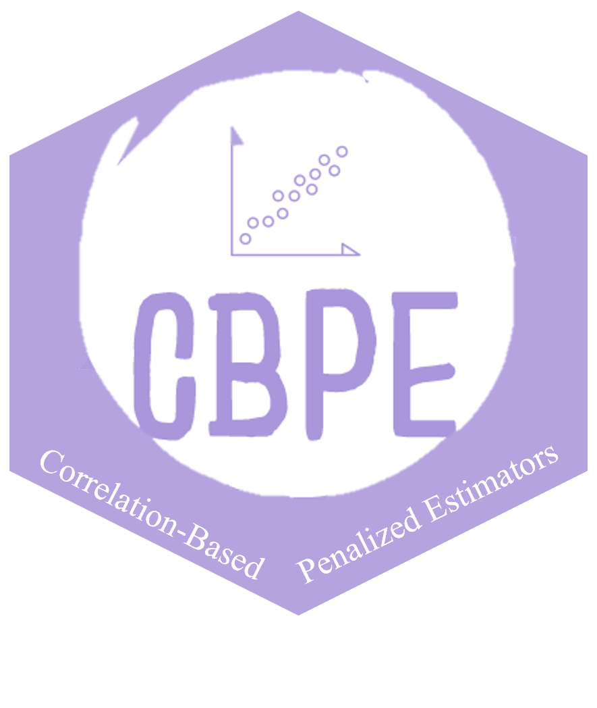

# CBPE 

[](https://github.com/mnrzrad/CBPE/actions/workflows/R-CMD-check.yaml)
[](https://cran.r-project.org/package=CBPE)
[](https://cran.r-project.org/package=CBPE)
[](https://cran.r-project.org/package=CBPE)
[](https://www.gnu.org/licenses/gpl-3.0.en.html)

The R package *CBPE* provides the correlation-based penalty estimators for linear and logistic regression models.

This work is funded by national funds through the FCT - Fundação para a Ciência e a Tecnologia, I.P., under the scope of the projects UIDB/00297/2020 and UIDP/00297/2020 (Center for Mathematics and Applications)".

## Installation

You can install the **stable** version from
[CRAN](https://cran.r-project.org/package=CBPE).

``` s
install.packages('CBPE', dependencies = TRUE)
```

You can install the **development** version from
[Github](https://github.com/mnrzrad/CBPE)

``` s
# install.packages("remotes")
remotes::install_github("mnrzrad/CBPE")
```

## To cite package `CBPE` in publications use:

Arashi, M., Rahimi, M., Norouzirad, M. (2024) *CBPE:
Corelation-Based Penalized Estimators*. R package version 0.1.0,
<https://cran.r-project.org/package=CBPE>.

A BibTeX entry for LaTeX users is

@Manual{CBPE, title = {CBPE: Corelation-Based Penalized Estimators},
author = {Arashi, M. and  Rahimi, M. and  Norouzirad, M.}, year = {2024}, note = {R package version 0.1.0}, url =
{<https://cran.r-project.org/package=CBPE>} }

## License

This package is free and open source software, licensed under GPL-3.
